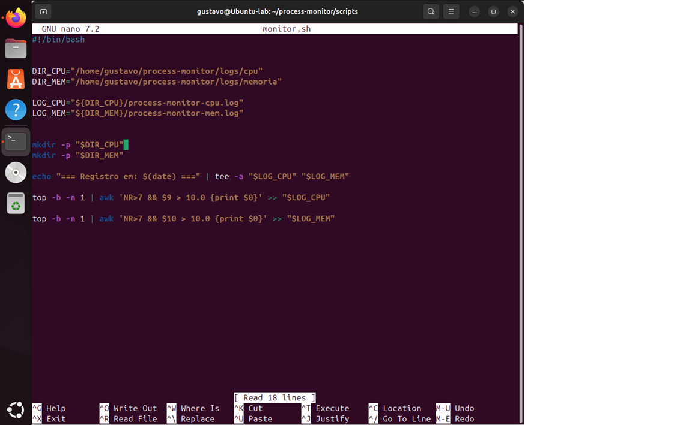
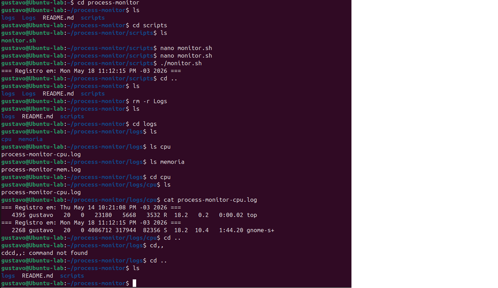
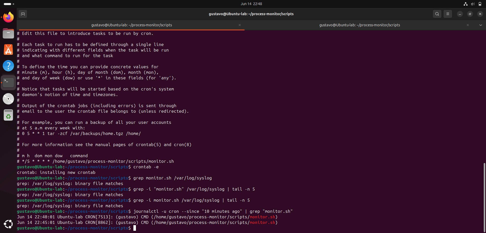
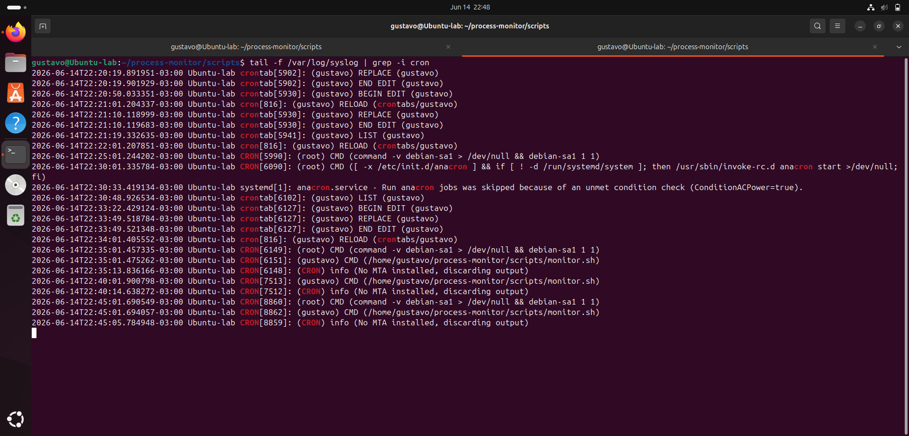

# Linux Process Monitor Lab

## Overview

This project is a Linux process monitoring script created as part of my Linux and cybersecurity learning journey.

The script monitors running processes using the `top` command, filters processes with high CPU and memory usage, and stores the results in dedicated log files for later analysis.

The goal of this lab is to practice:

* Linux process monitoring
* Bash scripting
* Log management
* Command pipelines
* Directory organization
* Basic automation concepts

---

## Technologies Used

* Linux (Ubuntu)
* Bash scripting
* `top`
* `awk`
* `tee`
* `cron`

---

## Project Structure

```bash
process-monitor/
│
├── scripts/
│   └── monitor.sh
│
├── config/
│   └── monitor.conf
│
├── logs/
│   ├── cpu/
│   │   └── process-monitor-cpu.log
│   │
│   └── memoria/
│       └── process-monitor-mem.log
│
├── prints/
│   ├── script-logic.png
│   ├── logs-output.png
│   ├── VirtualBox_ubuntu_14_06_2026_22_48_32.png
│   └── VirtualBox_ubuntu_14_06_2026_22_48_38.png
│
└── README.md
```

---

## How It Works

The script: Loads configuration values from an external configuration file
2. Creates log directories automatically if they do not exist
3. Runs the `top` command in batch mode
4. Processes the output with a single execution of `top`
5. Detects processes with high CPU usage
6. Detects processes with high memory usage
7. Ignores processes defined in a whitelist
8. Separates logs into dedicated directories
9. Stores execution date and time in log files
10. Prints execution information in the terminal using `tee`
11. Supports automated execution through Cron

---

## Script Example

```bash
#!/bin/bash

source /home/gustavo/process-monitor/config/monitor.conf

ALERT_CPU=10.0
ALERT_MEM=10.0

WHITELIST=("systemd" "dockerd" "mysql" "nginx")


top -b -n 1
```

---

## Example Output

```bash
=== Registro em: Mon May 18 11:12:15 PM -03 2026 ===

2268 gustavo 20 0 4086712 317944 82356 S 18.2 10.4 1:44.20 gnome-shell
```

---

## Screenshots

### Script Logic



### Logs Output



### Cron Configuration



### Cron Execution Validation



---

## Concepts Practiced

* Linux process analysis
* CPU usage monitoring
* Memory usage monitoring
* Bash pipelines
* Output redirection
* Log management
* Process filtering
* Directory automation
* Variable usage in Bash
* External configuration management
* Process whitelisting
* Task scheduling with Cron

---

## Future Improvements

* Add severity levels (Low, Medium, High, Critical)
* Add automatic alerts
* Add email notifications
* Add Telegram notifications
* Implement process priority adjustments
* Add automatic process termination for critical resource usage
* Improve log formatting and reporting
* Add monitoring statistics
* Implement log rotation

---

## Author

Gustavo Henrique Oliveira

---

## Final Notes

This lab is part of my practical studies in Linux, Cloud, and Cybersecurity.

The focus of this project is to improve hands-on skills with Linux system administration, monitoring, automation, and resource analysis.

